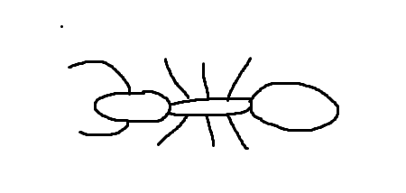

# 5010Assignment01-BuildYourOwnBinaary

## Spider, Ant, Centipede

A Spider, Ant, Centipede creauree is represented by three details
1. How many torsos they have
2. How many legs they have
3. Where the legs are distributed on the torsos

A creature may have anywhere from one torso and one leg, up to eight torsos and 16 legs

Torsos are represented by a three bit string
>000 (1 torso)
>
>111 (8 eight torsos)

Legs are represneted by a four bit string
>0000 (1 leg)
>
>1111 (16 legs)

Finally, we have a set of four bit strings to indicate where the legs should be placed.

The first bit in the string represents what side of the torso the leg is on
>1000 (top/left side of the first torso)
>
>0000 (right/ bottom side of the first torso)

The next three bits show which torso to place the leg on
>1101 (top/left of the 7th torso)
>
>0011 (right/botom of the 3rd torso)

For an example well make an ant. They have three torsos (head, thorax, abdomen) and eight legs (six on the thoeax, and two on the head as an antenna. Our ant will face towards the left

The command for our ant looks like this:
>011
>
>0100
>
>1000 0000 1010 1010 1010 0010 0010 0010

And here's what it looks like drawn out:

