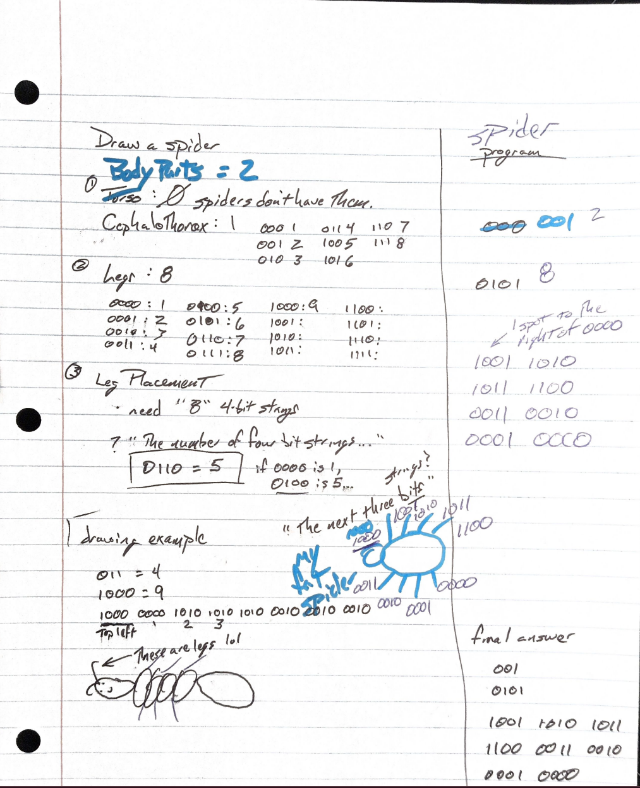

# Peer Feedback

## Feedback #1: Liz
User commentted that that there was a typo in the example drawing, and that there was a lack of clarity in explaining the link between leg amount and leg placment.

*insert image and code here*

## Feedback #2" Todd
User drew a spider using this string:
>001
>0101
>1001 1010 1011 1100 0011 0010 0001 0000

Here is an image of their work:

Todd also shared a string for me to decode and draw
>011
>1101
>1000 1001 1001 1001 1010 1010 1010 0001 0001 0001 0001 1010 1010 1010 1011

Here is my atempt:

We both struggled with some transmission errors, especially forgetting that 0000 = one in binary. The subject of the code being related to drawing creatures helped us as we expected biological symettry and were suprised when it was absent
